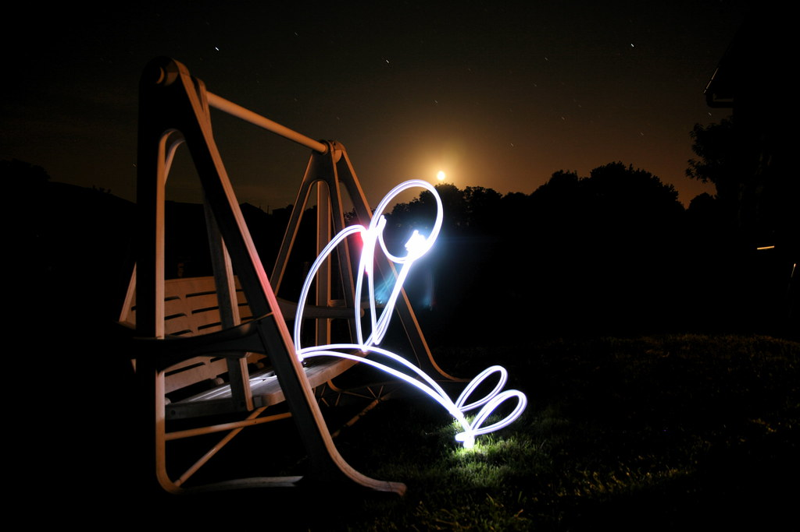
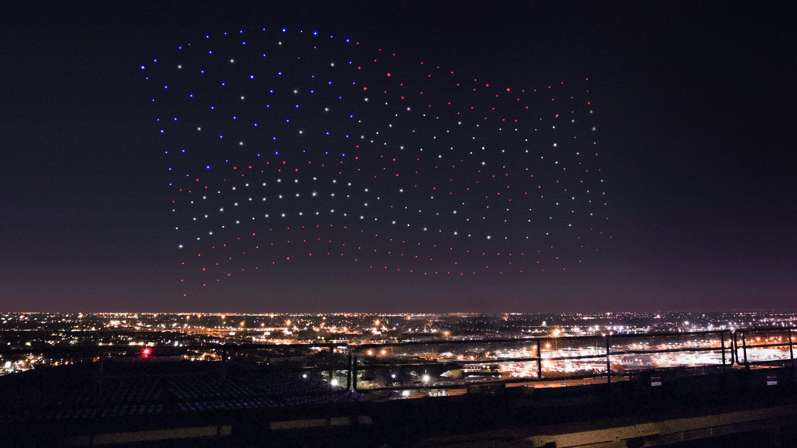

# crazyKhoreia
## Brief description.
crazyKhoreia is a robotic perception system intended for UAVs (aka drones), which takes a digital image and converts it into a waypoint matrix using X, Y and Z coordinates in meters for UAVs choreography design.
## How does it work?
crazyKhoreia takes a digital image and uses a vectorizing technic based on openCV [findContours](https://docs.opencv.org/3.4/d3/dc0/group__imgproc__shape.html#ga17ed9f5d79ae97bd4c7cf18403e1689a) algorithm to obtain contours, then, it gets waypoints from those contours, after that, depending on the usage mode (either lightPainting or multi-UAV formation), it optimizes the waypoints and finds a feasible 2D path travelling through **all** of them, minimizing the total travelled distance, thus, the flight duration (assuming constant speed).


### Light painting mode (class lightPainting)
Light painting is a photography technic consisting on capturing a long exposure photograph using a moving light source, the light source's movement creates an effect on the camera sensor which captures its trail, therefore, it "paints" all over the camera's frame, creating a painting optical effect.

 Source: [Rafael Rodrigo Perurena](https://www.flickr.com/photos/rafoto/2653254686)
### Multi UAV formation mode (to be implemented)
A multi UAV formation is made by several UAVs grouped together in patterns to construct a figure visible with a naked eye. It's been used by companies such as [Intel](https://www.intel.com/content/www/us/en/technology-innovation/intel-drone-light-shows.html) or [DSS](https://droneshowsoftware.com) to create terrific light shows performed by UAVs like the Super Bowl's half-time shows.
 Source: [Intel](https://twitter.com/intel/status/828430024411713536)

## Installation instructions.
### Prerequisites.
Before using crazyKhoreia, please install the following dependencies.
```console
$ pip3 install opencv-python
$ pip3 install numpy
$ pip3 install six
$ pip3 install mlrose
```

### Installing from Pypi with Python 3.
To install crazyKhoreia you'll need Python 3 and pip:
```console
pip3 install -i https://test.pypi.org/simple/ crazyKhoreia==0.0.1
```
### Installing from source.
If you'd like to develop, edit or have full access into the crazyKhoreia system them you may install it from source.
```console
git clone https://github.com/santiagorg2401/crazyKhoreia.git
```
## Usage.
crazyKhoreia's usage it's pretty straightforward, you'll only need a digital image and a few parameters:

| Parameter | Usage mode | Class | Description | Data type |
| --- | --- | --- | --- | --- |
| MAX_WIDTH | all | [lightPainting](https://github.com/santiagorg2401/crazyKhoreia/blob/e36bff07f4cf89e3d0205c949ff4bd80f890110e/src/crazyKhoreia/lightPainting.py#L17) | Maximum workspace width. | float
| MAX_HEIGHT | all | [lightPainting](https://github.com/santiagorg2401/crazyKhoreia/blob/e36bff07f4cf89e3d0205c949ff4bd80f890110e/src/crazyKhoreia/lightPainting.py#L17) | Maximum workspace height. | float
| MIN_WIDTH | all | [lightPainting](https://github.com/santiagorg2401/crazyKhoreia/blob/e36bff07f4cf89e3d0205c949ff4bd80f890110e/src/crazyKhoreia/lightPainting.py#L17) | Minimum workspace width. | float
| MIN_HEIGHT | all | [lightPainting](https://github.com/santiagorg2401/crazyKhoreia/blob/e36bff07f4cf89e3d0205c949ff4bd80f890110e/src/crazyKhoreia/lightPainting.py#L17) | Minimum workspace height. | float
| in_path | all | [lightPainting](https://github.com/santiagorg2401/crazyKhoreia/blob/e36bff07f4cf89e3d0205c949ff4bd80f890110e/src/crazyKhoreia/lightPainting.py#L17) | Image file path. | str
| led | all | [lightPainting](https://github.com/santiagorg2401/crazyKhoreia/blob/e36bff07f4cf89e3d0205c949ff4bd80f890110e/src/crazyKhoreia/lightPainting.py#L17) | Set led to ```True``` if you want to add led control within the waypoints output file, else, set ```False```. | bool
| detail | light painting | [lightPainting](https://github.com/santiagorg2401/crazyKhoreia/blob/e36bff07f4cf89e3d0205c949ff4bd80f890110e/src/crazyKhoreia/lightPainting.py#L17) | Used in [clean_waypoints](https://github.com/santiagorg2401/crazyKhoreia/blob/e36bff07f4cf89e3d0205c949ff4bd80f890110e/src/crazyKhoreia/crazyKhoreia.py#L79) method to delete the points that their euclidian distance is minor than **detail**. | float
| speed | light painting | [lightPainting](https://github.com/santiagorg2401/crazyKhoreia/blob/e36bff07f4cf89e3d0205c949ff4bd80f890110e/src/crazyKhoreia/lightPainting.py#L17) | Used in [calculate_stats](https://github.com/santiagorg2401/crazyKhoreia/blob/e36bff07f4cf89e3d0205c949ff4bd80f890110e/src/crazyKhoreia/lightPainting.py#L112) to estimate flight duration, assuming constant speed. **Side note:** It doesn't affect the waypoints dataset. | float
|sleepTime | light painting | [lightPainting](https://github.com/santiagorg2401/crazyKhoreia/blob/e36bff07f4cf89e3d0205c949ff4bd80f890110e/src/crazyKhoreia/lightPainting.py#L17) | Used in [calculate_stats](https://github.com/santiagorg2401/crazyKhoreia/blob/e36bff07f4cf89e3d0205c949ff4bd80f890110e/src/crazyKhoreia/lightPainting.py#L112) to estimate flight duration, assuming that the UAV stops at each reached waypoint for **sleepTime** seconds. **Side note:** It doesn't affect the waypoints dataset. | float
|video | light painting | [lightPainting](https://github.com/santiagorg2401/crazyKhoreia/blob/e36bff07f4cf89e3d0205c949ff4bd80f890110e/src/crazyKhoreia/lightPainting.py#L17) | Set video to ```True``` if you want to render an animation of the light painting generation, else set ```False```. | bool
|out_path|light painting | [lightPainting](https://github.com/santiagorg2401/crazyKhoreia/blob/e36bff07f4cf89e3d0205c949ff4bd80f890110e/src/crazyKhoreia/lightPainting.py#L17) | Files output path. | str

Take into account that lightPainting class creates an instance of the crazyKhoreia class in its constructor method.

To run the program, create an instance of the lightPainting class.
```console
lp = lightPainting(MAX_WIDTH, MAX_HEIGHT, MIN_WIDTH, MIN_HEIGHT, in_path, out_path, detail=0.05, speed=1.0, sleepTime=0.1, video=False, led=False)
```

After its execution you'll notice the output files within the set output path.

## Trouble?
Start a new [discussion](https://github.com/santiagorg2401/crazyKhoreia/discussions) if you have any question related to the project, but, if you have a technical issue or a bug to report, then please create an [issue](https://github.com/santiagorg2401/crazyKhoreia/issues).

## Authors.
- [Santiago Restrepo García.](https://github.com/santiagorg2401)
